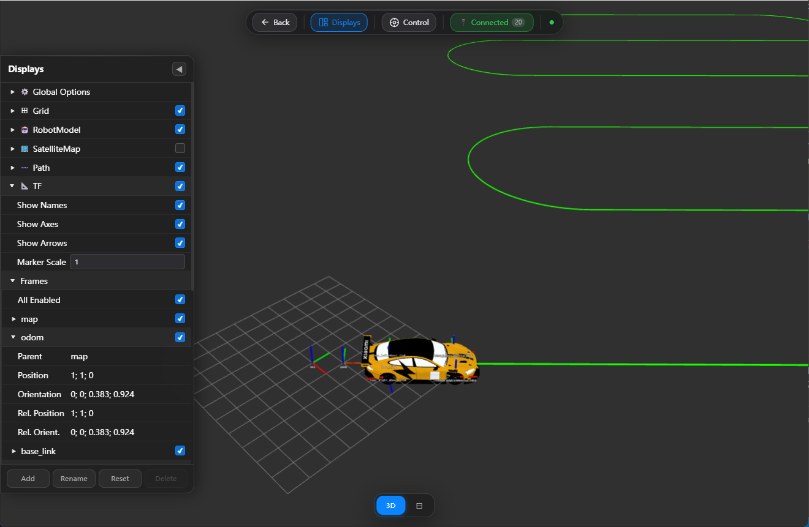

# kaiScope

> ROS 2 机器人可视化工具，基于 Three.js + React + Cesium 构建。  
> 版本：**v0.0.1**


## 功能概览
- TF 坐标系树可视化（Axes、Labels、Arrows）
- 卫星地图底图（Cesium）
- 机器人 URDF 


## Quick start
```bash
# install
sudo apt install ros-${ROS_DISTRO}-foxglove-bridge
# run bridge
ros2 run foxglove_bridge foxglove_bridge
# run container(该方式启动，robot的mesh加载会有问题)
docker run -it --rm \
  --name kaiscope \
  -p 8766:80 \
  crpi-etx06pm0ontyst6p.cn-shanghai.personal.cr.aliyuncs.com/ros-humble/kaiscope:arm64
```